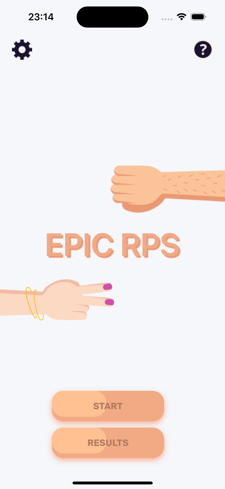
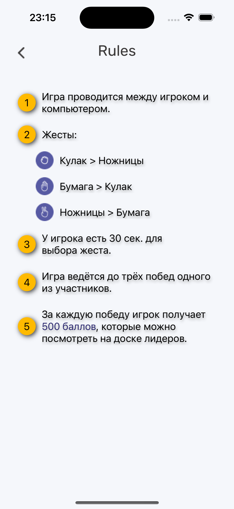
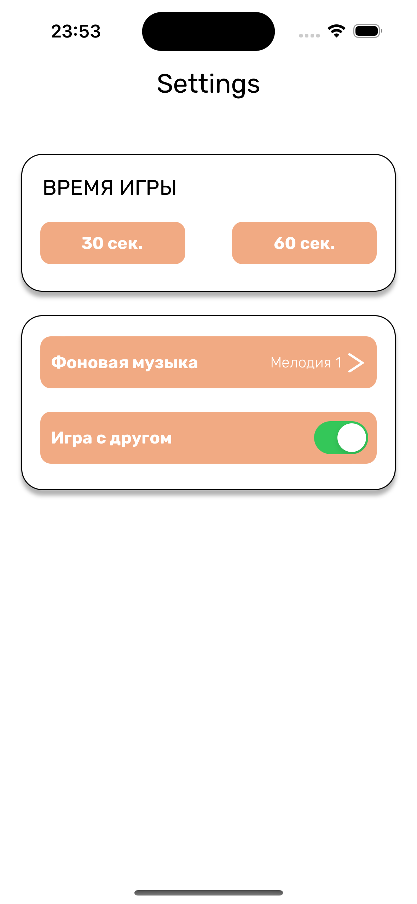
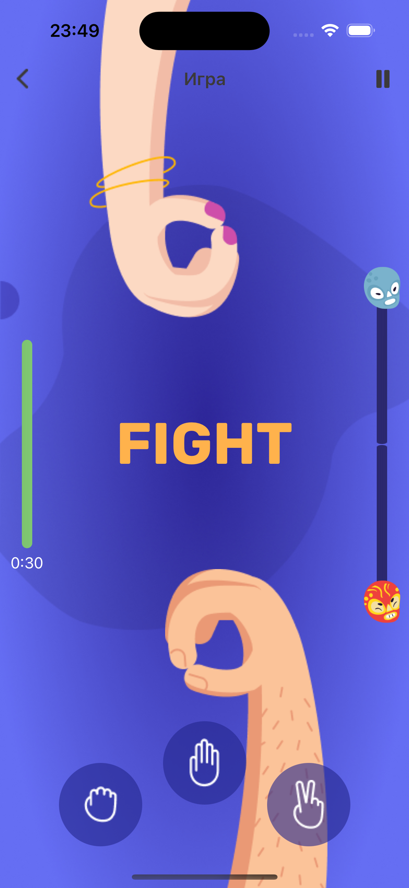
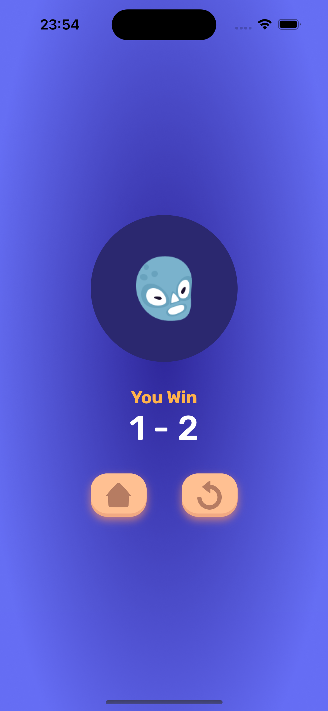

## EPIC RPS
Это простая и популярная игра для двух игроков, которая часто используется для быстрого принятия решений или просто для развлечения. Цель игры — выиграть как можно больше раундов, демонстрируя правильные жесты против жестов соперника.

## Stack: 
- Swift
- UIKit

## Особенности:
 - Таблица лидеров
 - Изменение аватара игрока
 - Изменение имени игрока
 - Изменение времени игры
 - Изменение фоновой музыки состязания

## Начало работы:
Чтобы начать работу с EPIC RPS, выполните следующие шаги:

1. **Клонировать репозиторий**: Склонируйте этот репозиторий на ваш локальный компьютер с помощью команды `https://github.com/Dual-Ice/rps-game-ios.git`.
2. **Сборка и запуск**: Откройте проект в Xcode, выполните сборку и запустите приложение на вашем iOS симуляторе или физическом устройстве.

## Contributors:
- [Dual-Ice](https://github.com/Dual-Ice)
- [Bokhulenkov](https://github.com/Bokhulenkov)
- [nikmosyl](https://github.com/nikmosyl)
- [DmitriyLubov](https://github.com/DmitriyLubov)
- [AML1708](https://github.com/AML1708)
- [OlgaChusheva](https://github.com/OlgaChusheva)
